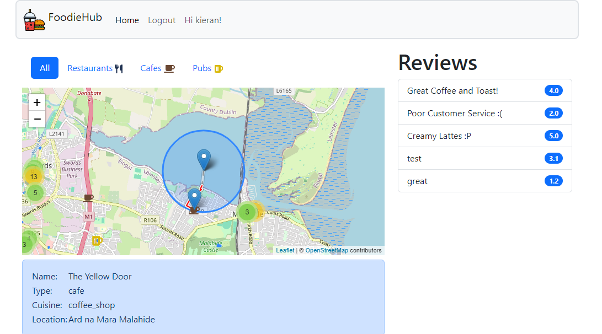
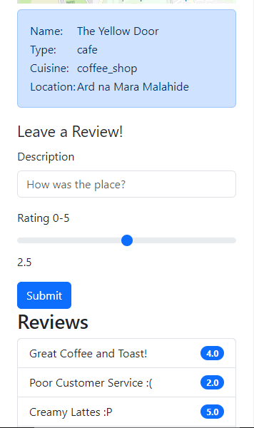

# FoodieHub

https://awm-lab6.shop (username: "Kieran", password: "kieran")

- A django pwa application that maps restaurants, cafes and pubs in the Dublin area
- User can filter the amenity that they need
- Routing can be done by clicking on the marker on the map
- Reviews of each amenity can be seen and a user can leave their own review
- Location is updated when the user moves around
- It is deployed on an azure VM and served through nginx with a certbot certificate

## Screenshot

## Mobile View:

